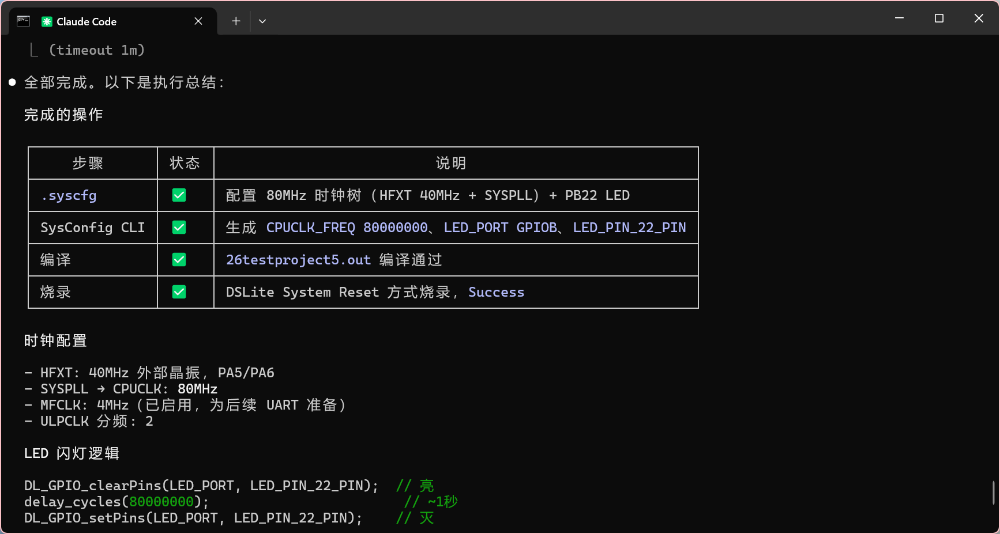
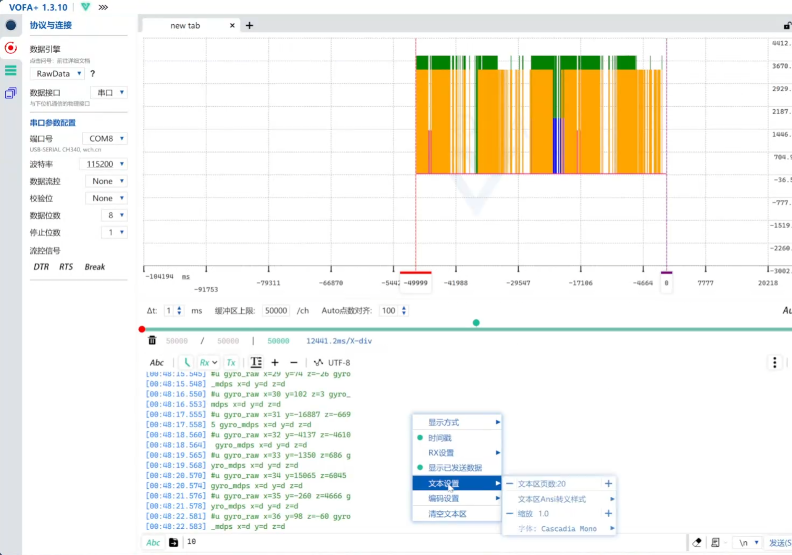

<div align="center">

# MSPM0 Skill

**让 AI Agent 真正参与 MSPM0 的 SysConfig 配置、工程构建、烧录与调试。**

[](https://github.com/mc3545dada/mspm0-skill/stargazers)
[](https://github.com/mc3545dada/mspm0-skill/releases/latest)
[](https://www.ti.com/microcontrollers-mcus-processors/arm-based-microcontrollers/arm-cortex-m0-mcus/overview.html)
[](LICENSE)

[快速安装](#快速安装) · [快速使用](#快速使用) · [亮点](#核心亮点) · [实战展示](#实战展示) · [内置例程](#内置例程)

</div>

面向MSPM0 开发与电赛备赛，适用于 Claude Code、Codex、OpenCode、OpenClaw、Continue、Cursor 等 CLI / 编辑器 Agent。这是一组经过真实项目验证的规则、脚本、例程和调试 Skill。

> [!IMPORTANT]
> 已在 **立创天猛星 MSPM0G3507 + CCS Theia / CLion + J-Link / DAPLink** 环境中完成真实板级验证。Agent 能直接修改 `.syscfg`、调用现有工具链构建，并根据探针选择 DSLite、CCS-DSS 或 OpenOCD 路径。

## 核心亮点

| 能力 | 能解决什么问题 |
| --- | --- |
| **直接理解 SysConfig** | 检查和修改 `.syscfg`，保留 metadata、时钟树、PinMux、DMA 与中断配置，不直接篡改 `ti_msp_dl_config.c/.h` |
| **识别工程与工具链** | 区分 CCS、Keil/uVision、CMake + GCC/OpenOCD，以及简单工程、分层框架和 FreeRTOS 工程 |
| **自动构建与烧录** | 固化 SysConfig CLI、gmake、TI Arm Clang、CMake、DSLite/J-Link 和 OpenOCD 工作流 |
| **连接真实硬件调试** | 支持 CCS-DSS 与 OpenOCD/GDB 两条调试链路，辅助断点、寄存器、符号和复位检查 |
| **锁定诊断与恢复引导** | 辅助区分探针断连、MEM-AP 不可用和 NONMAIN/安全策略异常，并在用户授权擦除后引导 UART BSL、DSSM Mass Erase 或 Factory Reset 恢复 |
| **串口闭环验证/调参** | Python 串口收发、文本帧/二进制测试，可用于 PID 与控制参数调试 |
| **例程与 SDK 检索** | 优先利用用户工程和 TI SDK 官方例程，同时提供经过验证的 GPIO、PWM、Timer、UART/DMA 样例 |

## 快速安装

```bash
npx skills add mc3545dada/mspm0-skill@mspm0-ccs
```

也可以只复制本仓库的可安装目录：

```text
skills/mspm0-ccs/
```

| Agent | 常见安装位置 |
| --- | --- |
| Claude Code | `~/.claude/skills/mspm0-ccs/` |
| Codex 等 | `~/.agents/skills/mspm0-ccs/` |
| OpenClaw | `~/.openclaw/skills/mspm0-ccs/` |

<details>
<summary><strong>Windows PowerShell 手动安装</strong></summary>

```powershell
New-Item -ItemType Directory -Force "$env:USERPROFILE\.claude\skills" | Out-Null
Copy-Item -Recurse -Force .\skills\mspm0-ccs "$env:USERPROFILE\.claude\skills\mspm0-ccs"
```

</details>

### 运行环境

- 辅助脚本需要 Python 3.10 或更高版本。
- 串口工具额外需要 `pyserial`：`python -m pip install pyserial`。
- SDK、SysConfig、CCS/UniFlash、OpenOCD、GDB 等开发工具不会随 skill 自动安装，只需准备当前工作流实际使用的工具。

## 快速使用

安装skill后，确认你已经配置好了IDE/工具链/烧录器(也可让Agent检查)

连接烧录器后，可以直接尝试

在 MSPM0 工程目录中直接告诉 Agent：

```text
请使用 mspm0-ccs skill，检查当前工程的 .syscfg 和工具链，
为立创天猛星 PB22 板载 LED 配置 1 秒闪烁，完成构建并烧录。
```

也可以针对现有工程继续开发：

```text
请使用 mspm0-ccs skill，(读取AGENTS.md) 保留现有工程结构和无关配置，
为我选择一个可用的串口并告诉我连接方式，之后用 Python 串口工具验证回显。
```

对于新项目，建议使用Plan模式开始开发

对于所有需要外接模块的情况，建议提供模块数据手册给Agent

开发前，建议根据自己风格让其设计AGENTS.md文件(如划分BSP/APP目录等)

Agent 会先识别工程结构、`.syscfg`、生成符号、构建方式和探针，再选择对应流程；不会默认把示例目录结构强行搬进用户工程。

## 实战展示

### 2024 年电赛 H 题：全程使用本 skill 开发

仓库：**[2024hVibe：完整代码与 Agent 对话记录](https://github.com/mc3545dada/2024hVibe)**

从需求分析、SysConfig 外设配置、工程修改到板级调试均由本 skill 辅助完成，可作为端到端使用参考。

- [2024 年电赛 H 题完整实战演示](https://www.bilibili.com/video/BV1w9Nc69EXP/)
- [MSPM0 Skill 完整使用视频](https://www.bilibili.com/video/BV1RbLY6xECu)

<table>
  <tr>
    <td width="50%"></td>
    <td width="50%"></td>
  </tr>
  <tr>
    <td align="center">SysConfig、编译与烧录结果</td>
    <td align="center">串口收发与 VOFA+ 验证</td>
  </tr>
</table>

更多过程截图见 [`assets/screenshots/`](assets/screenshots/)。

## 已验证环境

| 类别 | 已验证组合 |
| --- | --- |
| 开发板 | 立创天猛星 MSPM0G3507 |
| IDE / 环境 | CCS Theia、Keil、VS Code、CLion |
| SDK / SysConfig | MSPM0 SDK 2.10.00.04 / 2.11.00.07、SysConfig 1.26.2 / 1.28.0 CLI |
| 编译器 | TI Arm Clang 4.x LTS、Arm GNU Toolchain / CMake |
| 探针 | J-Link、XDS110、DAPLink / CMSIS-DAP |
| 烧录与调试 | UniFlash / DSLite、CCS-DSS、OpenOCD / GDB |
| 外设 | GPIO、PWM、Timer、UART + DMA、I2C、SPI、ADC等 |

其他开发板、芯片封装、SDK/CCS/Keil/CMake 版本和调试器可能同样可用，但尚未全部实机验证。迁移到新组合时，建议先完成最小点灯、串口或定时器测试。

## 内置例程

| 例程 | 主频 | 主要内容 |
| --- | --- | --- |
| `empty_project` | 32 MHz | 空工程基线 |
| `led_blink` | 32 MHz | PB22 板载 LED 闪烁 |
| `pwm_breath_led` | 80 MHz | PB22 / TIMG PWM 呼吸灯 |
| `timer_irq_led` | 80 MHz | TIMG12 1 ms 中断，ISR 每 500 ms 翻转 PB22 |
| `uart_blocking_tx` | 80 MHz | UART0 阻塞发送字符串 |
| `uart_dma_tx_irq_rx` | 80 MHz | 双 UART、DMA 发送、中断/轮询接收与文本帧解析 |

例程是经过验证的参考，不是必须照搬的模板。Agent 应以用户现有工程结构为准，只提取需要的 `.syscfg` 字段、代码模式或调试经验。

<details>
<summary><strong>常用脚本与命令</strong></summary>

以下命令默认在本仓库根目录执行；从其他目录调用时请使用脚本绝对路径。

检查 MSPM0 工程：

```powershell
python skills\mspm0-ccs\scripts\check_syscfg.py C:\path\to\project
```

使用工程声明的 SysConfig/SDK 版本，在临时目录中安全验证生成结果：

```powershell
python skills\mspm0-ccs\scripts\run_sysconfig.py C:\path\to\project
```

只读识别探针并对比工程配置：

```powershell
python skills\mspm0-ccs\scripts\detect_probe.py
python skills\mspm0-ccs\scripts\check_syscfg.py C:\path\to\project --probe
```

探针检测为空只表示“当前方法未识别”，不能直接断言烧录器未连接。部分 DAPLink/CMSIS-DAP 或 XDS110 会表现为复合 USB 设备或虚拟串口，可继续检查：

```powershell
python skills\mspm0-ccs\scripts\serial_console.py --list
Get-PnpDevice -PresentOnly
```

串口收发测试：

```powershell
python skills\mspm0-ccs\scripts\serial_console.py --list
python skills\mspm0-ccs\scripts\serial_console.py -p COM6 -b 115200 --timestamp --duration 10
python skills\mspm0-ccs\scripts\serial_console.py -p COM6 -b 115200 --send "ping" --send-line --timestamp --duration 3
```

查看内置例程和搜索 TI SDK：

```powershell
python skills\mspm0-ccs\scripts\list_examples.py
python skills\mspm0-ccs\scripts\index_syscfg_examples.py C:\ti\mspm0_sdk_2_10_00_04 --board LP_MSPM0G3507 --module UART
```

CCS-DSS 调试：

```powershell
python skills\mspm0-ccs\scripts\ccs_dss_debug.py C:\path\to\project probe --leave-running
python skills\mspm0-ccs\scripts\ccs_dss_debug.py C:\path\to\project run-to-symbol --symbol main --load --reset "System Reset"
```

OpenOCD/GDB 调试，需要含 TI MSPM0 扩展的 OpenOCD：

```powershell
python skills\mspm0-ccs\scripts\openocd_debug.py C:\path\to\project probe
python skills\mspm0-ccs\scripts\openocd_debug.py C:\path\to\project flash
python skills\mspm0-ccs\scripts\openocd_debug.py C:\path\to\project registers
python skills\mspm0-ccs\scripts\openocd_debug.py C:\path\to\project run-to-symbol --symbol main
```

</details>

## 使用前须知

- 修改 `.syscfg` 后需要重新运行 SysConfig 或重新构建工程。
- 烧录前确认 CCS `targetConfigs/*.ccxml`、Keil 调试器配置或 OpenOCD `.cfg` 与真实探针一致。
- CCS-DSS 与 OpenOCD/GDB 是两条独立调试路径，不要混用配置。
- 同一探针不要并行运行多个 OpenOCD 操作；遇到芯片锁定或保护时停止自动操作并提示用户手动解锁。
- 串口测试前关闭 VOFA+ 等占用同一串口的软件。
- 不确定硬件行为时应区分“代码/构建验证通过”和“真实板级验证通过”。

## 参考资料

- [TI SysConfig](https://www.ti.com/tool/SYSCONFIG)
- [TI MSPM0 SDK](https://www.ti.com/tool/MSPM0-SDK)
- [TI MSPM0 SysConfig Guide](https://software-dl.ti.com/msp430/esd/MSPM0-SDK/2_05_01_00/docs/english/tools/sysconfig_guide/doc_guide/doc_guide-srcs/sysconfig_guide.html)
- [TI LP-MSPM0G3507](https://www.ti.com.cn/tool/cn/LP-MSPM0G3507)
- [立创天猛星 MSPM0G3507 文档](https://wiki.lckfb.com/zh-hans/tmx-mspm0g3507/)

## 开源协议

本项目使用 [MIT License](LICENSE)。
